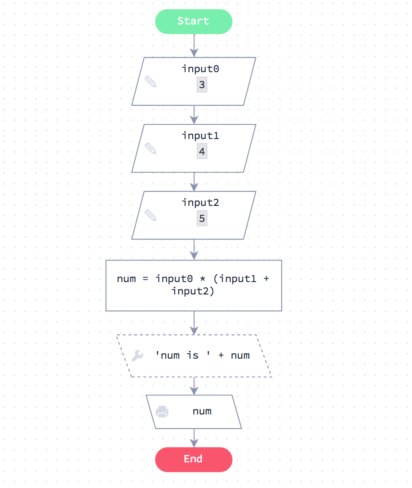
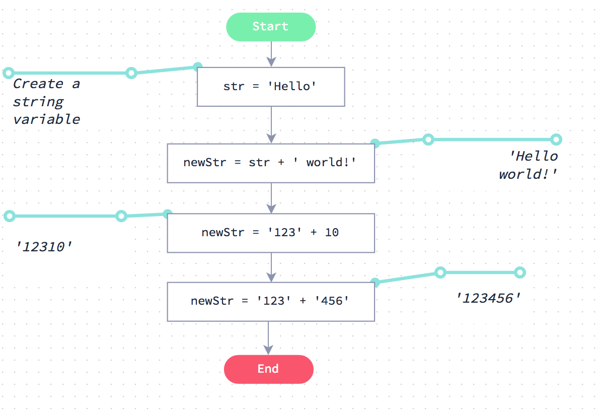

1 \. Expresiones numéricas y de cadena
======================================================

¿Estás listo para comenzar a escribir código de verdad?

Te recomendamos que aprendas JavaScript ya que esto abre el mundo del desarrollo web. También puedes hacer el "lado del servidor" de desarrollo con JavaScript, esto se utiliza para cosas como la escritura de archivos y manejo de Base de Datos.

El mejor enfoque es trabajar a través del curso usando primero el lenguaje JavaScript. Una vez que hayas completado el curso usando JavaScript, te resultará mucho más fácil trabajar  con tecnología web.

1 \. 1 \. Entradas y salidas
==========================

La forma en que se maneja las entradas y salidas en código es muy similar a los diagramas de flujo.

Haga clic en el botón de abajo para **Ejecutar Código**. Los resultados del programa aparecerán justo debajo del botón.

```js

// Obtener la entrada desde la línea de comandos
var digit1 = 123 // prompt (mensaje)
var digit2 = 324 // prompt (mensaje)
var digit3 = 546 // prompt (mensaje)

// Las variables digit1, digit2 y digit3 ahora están siendo asignadas
// valores pasados al programa.

// Haga algo matemático
var num = digit1 * (digit2 + digit3)

// la variable num ahora contiene el  resultado de la expresión matemática

// Imprimir algunos resultados (outputs)
console.log ('Nuestros resultados:')
console.log ('digit1 =' + digit1)
console.log ('digit2 =' + digit2)
console.log ('digit3 =' + digit3)
console.log ('num =' + num)
```

[EJECUTAR CÓDIGO](https://github.com/aocsa/LaboratoriaJS/blob/master)

Inputs (Entradas)
-----------------

Usted obtendrá un input (entrada) para su código usando la función `promt()`. JavaScript hace esto fácil, proporcionando acceso a los argumentos de línea de comandos como éste:

```js
var digit1 = prompt("input 1") 
var digit2 = prompt("input 2")
var digit3 = prompt("input 3")
```

Usted aprenderá más sobre cómo funciona ésto más adelante. Por ahora, ésto es suficiente para usted.

Outputs (Salidas)
-----------------

Para emitir datos, utilice la función `console.log ()` como se muestra a la izquierda. Ésto puede contener cualquier expresión JavaScript válida.

1 \. 2 \. Errores
=================

A menudo cometerá errores al escribir código. Pronto se acostumbrará a ésto, lo importante es desarrollar la habilidad de aprender a entender los errores y luego arreglarlos (debugging o depuración).

Mire el código de abajo. Este código contiene un error de sintaxis simple.

Ahora presione el botón de abajo para ejecutar el código.

```js
// Obtener inputs desde la línea de comandos
var digit1 = 123 // prompt
var digit2 = 324 // prompt
var digit3 = 546 // prompt

// Existe un error en ésta línea
var num =  digit1 +  digit4

//Output
console.log ('digit1 = ' + digit1)
console.log ('digit2 = ' + digit2)
console.log ('digit3 = ' + digit3)
console.log ('num = ' + num)

```

[EJECUTAR CÓDIGO](https://github.com/aocsa/LaboratoriaJS/blob/master)

Cuando ejecute el código, verá aparecer un error

Entendiendo el error
--------------------

El error parece bastante hostil. Sin embargo, si lee el error cuidadosamente y mira hacia atrás a través de su código, debería ser capaz de averiguar qué hacer para solucionarlo. Echa un vistazo a la siguiente explicación.

Este es el mensaje de error:

```
ReferenceError: digit4 is not defined (digit4 no esta definido)

```

Vamos a analizarlo:

* `ReferenceError:` Esto simplemente nos dice que hay un error.
* `digit4 is not defined` Esto nos dice que la variable` digit4` no está definida en ninguna parte de nuestro código aunque hemos intentado usarlo.

La información que viene debajo de esas líneas iniciales es realmente para situaciones de depuración más avanzadas y puede ignorarse de forma segura por ahora.

1 \. 3 \. Experimentos
======================

Esta ventana se proporciona para que pruebe cualquier código que desarrolle. Úselo para experimentar y practicar.

Hay un código de inicio proporcionado para usted. Este código se explicará en las siguientes páginas.

```js

// Escriba algún código abajo

console.log ('Experimentos')

```

[EJECUTAR CÓDIGO](https://github.com/aocsa/LaboratoriaJS/blob/master)

1 \. 4 \. Semicolons (Punto y coma)
===================================

Es posible que se le haya dicho que necesita poner los puntos y coma `;` al final de cada línea en código JavaScript. **Esto no es verdad**.

Puedes *poner* punto y coma al final de cada línea, pero ciertamente no tienes que hacerlo. Hay solamente 2 casos especiales donde ésto es necesario y usted no encontrará estos casos hasta que usted se encuentre mucho más avanzado e incluso entonces será muy raro.

Por lo tanto, nuestro consejo es no utilizar ningún punto y coma en absoluto. En estos ejemplos, no los usamos para nuestro desarrollo.

2 \. Expresiones numéricas
==========================

Empecemos partiendo de un digrama de flujo que demuestre una expresión numérica.

Si pasa por el gráfico verá que evalúa las expresiones A ∗ (B + C)

En la siguiente página verá exactamente el mismo código escrito en JavaScript



2 \. 1 \. Código equivalente
============================

Abajo está el código JavaScript equivalente al digrama de flujo de la página anterior.

Si ejecuta el código verá que se ocupa de la expresión numérica exactamente de la misma manera que hizo el gráfico de Flode.

```js

// Obtener inputs (entradas) desde la línea de comandos
var input0 = 1213
var input1 = 123
var input2 = 322

// Más código
var num = input0 * (input1 + input2)

// Una sentencia de debug (depuración)
console.info ('num is' + num)

// Output (Salida)
console.log (num)

```

[EJECUTAR CÓDIGO](https://github.com/aocsa/LaboratoriaJS/blob/master)

2 \. 2 \. Adición
=================

Reto
----

Su código debe esperar un input. Todo lo que necesitas hacer es añadir 12 al input y dar un output al resultado.

```js

// Obtener un input desde la línea de comandos
// Asegúrese de que el input se almacena como un número
var input = 12 // +process.argv [2]

// Su código va aquí


```

[VERIFICAR CÓDIGO](https://github.com/aocsa/LaboratoriaJS/blob/master)

2 \. 3 \. A \* (B + C / 3)
==========================

Pasamos tres inputs, A, B y C.

Debe dar salida A* (B + C/3).

```js

// Obtenga nuestro input desde la línea de comandos
// Asegúrese de que el input se almacene como un número
var A = +process.argv [2]
var B = +proceso.argv [3]
var C = +process.argv [4]

// Su código va aquí

```

[VERIFICAR CÓDIGO](https://github.com/aocsa/LaboratoriaJS/blob/master)

3 \. Expresiones de strings (cadenas) 
======================================

Mira el digrama de flujo de abajo. Si lo revisa, verá cómo se maneja los strings. En la siguiente página, aprenderá cómo hacer lo mismo usando  código.

Al pasar por el gráfico, puede ver qué sucede con las variables después de cada operación.



3 \. 1 \. Código equivalente
============================

Abajo se puede ver el código equivalente al diagrama de flujo anterior.

Como puede ver, es exactamente casi lo mismo.

```js

var str = 'Hola' 		             // Crear una variable de cadena
var newStr = str + 'mundo!'   	 // '¡Hola Mundo!'
console.log(newStr)		         // output

newStr = '123' + 10		          // '12310'
console.log(newStr) 		       // output

newStr = '123' + '456' 		     // '123456'
console.log (newStr)		       // output

```

[EJECUTAR CÓDIGO](https://github.com/aocsa/LaboratoriaJS/blob/master)

3 \. 2 \. Concatenando Strings
=========================

Le estamos proporcionando una cadena como entrada para su programa.

Su tarea es agregar el string: `, hola!` al string que le proporcionamos y luego la emitiremos.

¡Asegúrese de incluir el espacio después de la coma!

```js

// Obtener el input desde la línea de comandos
var inputText = process.argv [2]

// Su código va aquí

```

[VERIFICAR CÓDIGO](https://github.com/aocsa/LaboratoriaJS/blob/master)

3 \. 3 \. Unirse a más strings
==============================

Le proporcionaremos 2 strings a su programa.

Su trabajo es unir los strings para obtener un solo string con un espacio entre los dos strings originales.

Éste es un caso común en la codificación y usted tendrá que crear su string uniendo los inputs y añadiendo el espacio en el medio.

```js

// Obtener un input desde la línea de comandos
var string1 = process.argv [2]
var string2 = process.argv [3]

// Su código va aquí


```

[VERIFICAR CÓDIGO](https://github.com/aocsa/LaboratoriaJS/blob/master)