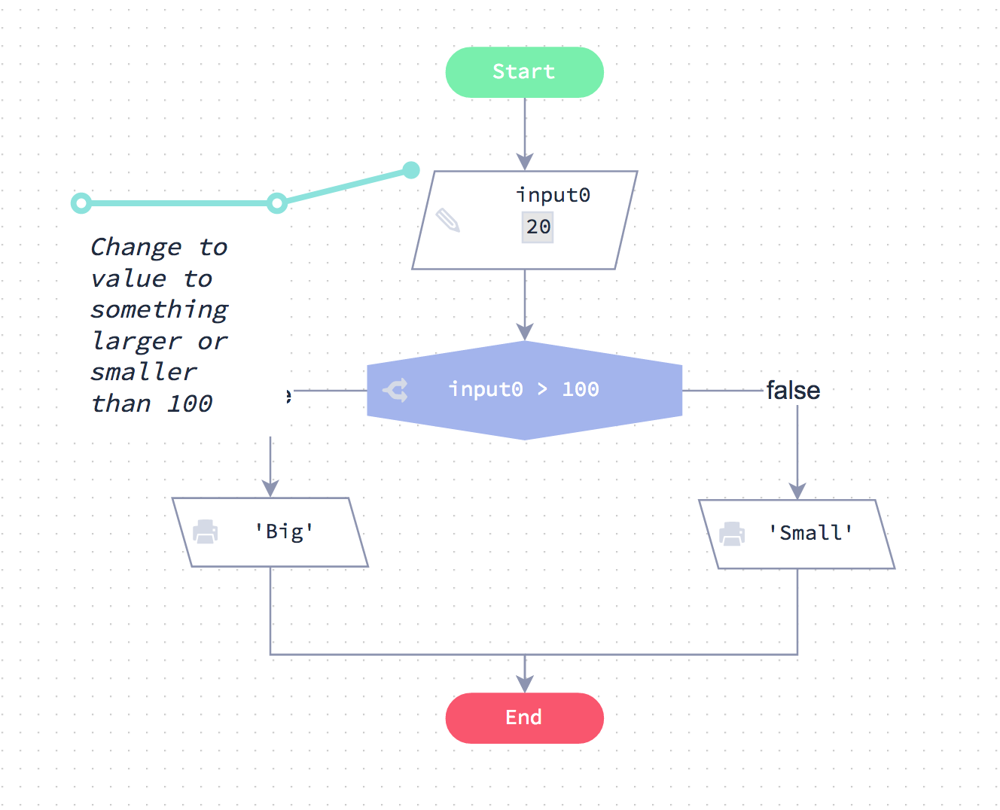
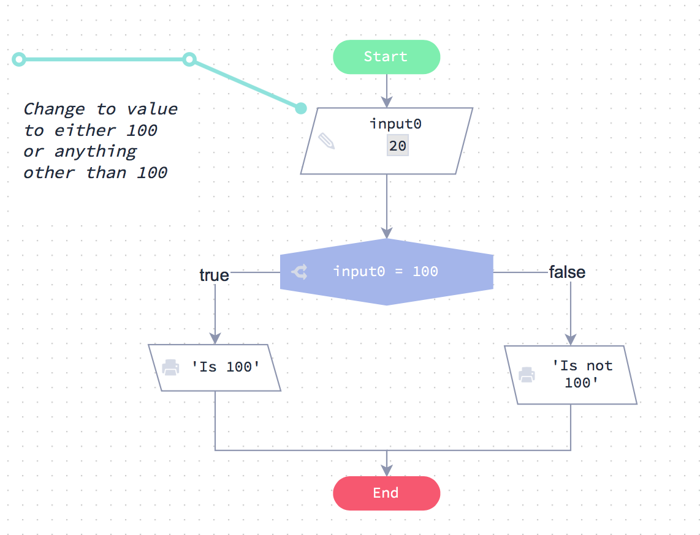
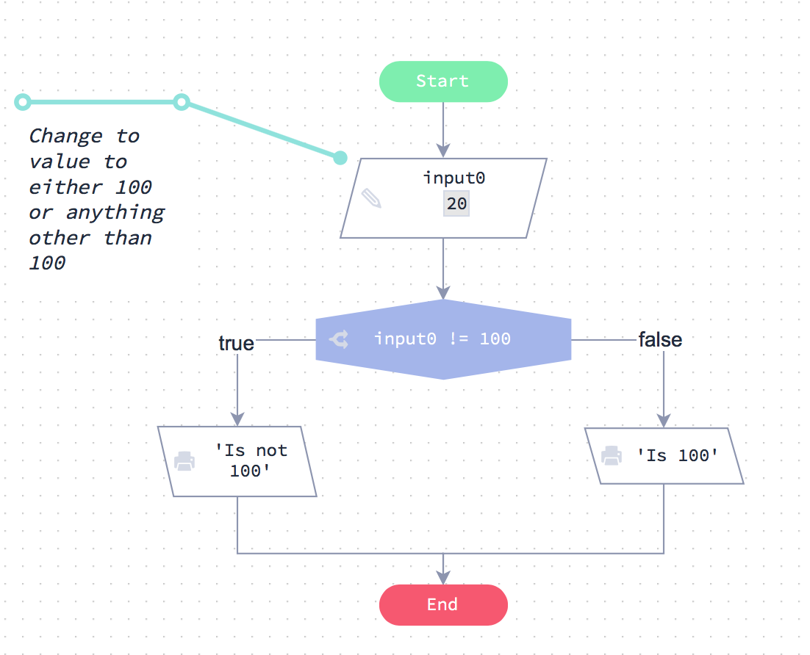
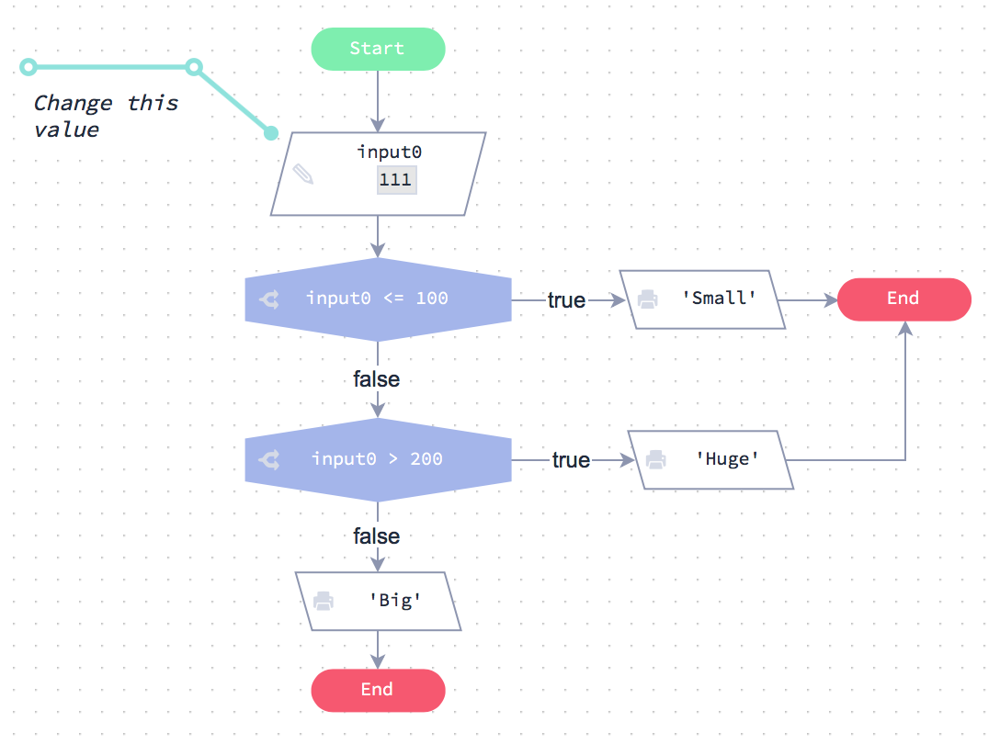
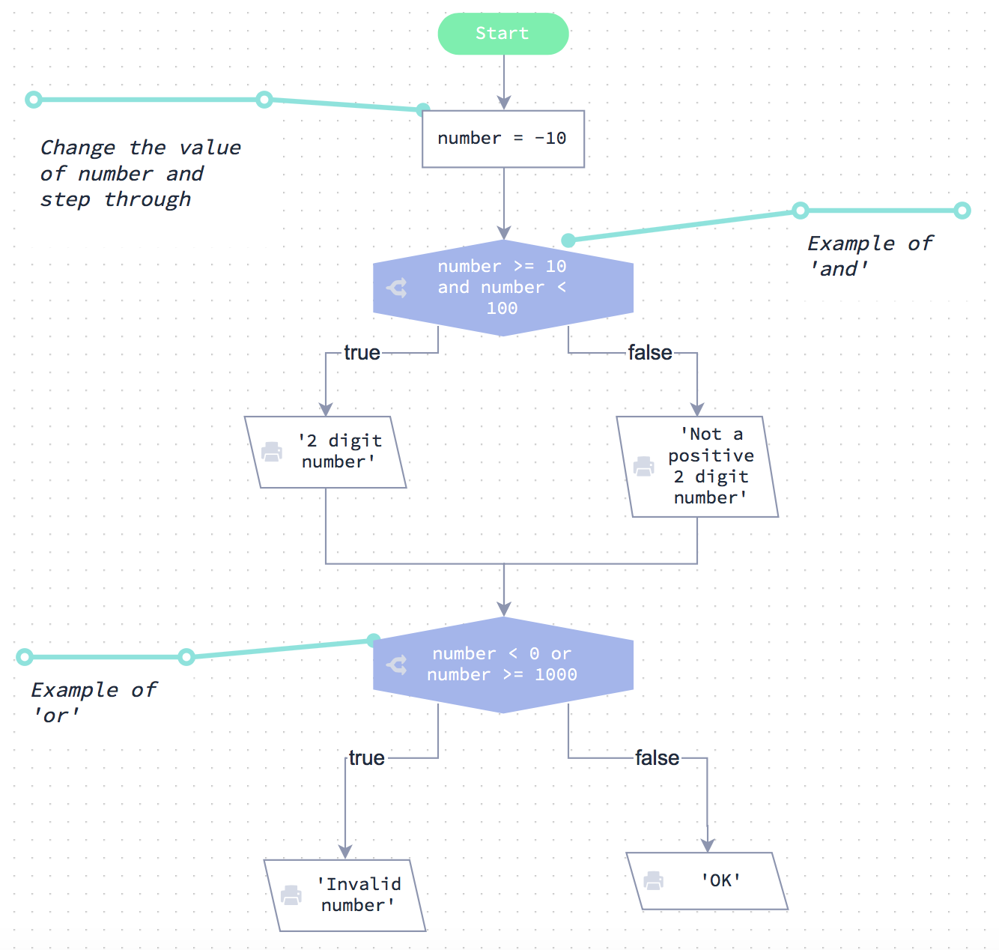

This unit is about using conditional statements in JavaScript.

Here is a good example:

```js
if (number >= 10 && number < 100 ) {  // 1. if number is 2 digits long
  console.log('2 digit number')       // then output text saying so
}
else if (number >= 100 ) {            // 2. otherwise, if more than 2 digits
  console.log('multi digit number')   // then output text saying so
}
else {                                // 3. otherwise 
  console.log('1 digit number')       // this must be a single digit number
}
```

If number is greater than or equal to 10 **and** number is less than 100, **then** output ‘2 digit number’ **otherwise if** number is greater than or equal to 100 output ‘multi digit number’ **otherwise** output ‘1 digit number’

1\. 1\. Experiments
===================

This window is provided for you to try out any code you develop. Use it to experiment and practise.

There is some starter code provided for you. This code will be explained on the following pages.

```js
// Write experimental code below

console.log('your experiment file')

```

[RUN THE CODE ]()

2\. Conditions explained
========================

Have a look at the Flode chart on the left; the chart demonstrates using a condition.

If you step through the chart you will start to see how conditions work.

Flode example
-------------

In this example, the condition is input0 \> 100\. You can see how this condition can be either true or false. These are the only two possible outcomes of the decision.

Step through the Flode chart to see how it executes depending on the value that has been input.

Try the chart out again by changing the test input value to 50, then step through it. Now change the input to 200 and step through it again. You should see that depending on the input you have given, the execution path that Flode follows will change.



2\. 1\. Conditions in code
==========================

On the left is the JavaScript code equivalent of the Flode chart from the previous page.

If you run the code you will see that it deals with the conditional statement in exactly the same way as the Flode chart did.

```js

// Get input from the command line
var number = +process.argv[2]

// Your code goes below

// Output the program's input number
console.log('Command line input is: ' + number)

// And here comes our 'if' statement
if ( number > 100 ) {
  console.log ('Big')
}
else {
  console.log ('Small')
}

```

[RUN THE CODE ]()

Have a look at how this code works:

First of all, the test data for our input variable `number`, comes from the command line.

```
var number = process.argv[2] 
```

And here comes the important bit. An `if` statement is used to check whether `number` is greater than 100\. If it is, then we output the string 'Big’. Otherwise, we output the string 'Small’.

```js
if ( number > 100 ) {
  console.log ('Big')
}
else {
  console.log ('Small')
}
```

2\. 2\. Conditional statements explained
========================================

Now we are going to look in more detail at how the `if` statement works. Here is the full code again:

```js
if ( number > 100 ) {
  console.log ('Big')
}
else {
  console.log ('Small')
}
```

First, have a look at the first line:

    The if statement
    ----------------

    ```
    if ( number \> 100 ) { 
    ```

    1. Start the line with `if`.
    2. Now specify the condition inside the brackets `(condition)`.
    3. Finally, at the end of the line you add a `{`, known as a **curly bracket**.

    If the condition is true
    ------------------------

    **If** the condition is true, then you carry out all the instructions that come after it, within the `{` `}`. In this example there is only one instruction.

    ```
     console.log ('Big') 
    ```

    Everything between `{` and `}` is called a *code block*.

    Otherwise
    ---------

    If the condition is **not true**, the `else` code block executes instead.

    ```
     console.log ('Small') 
    ```

    Code blocks
    -----------

    The `{` at the end of the `if` line is used to start a code block. Once the code block has been started, you add the code you want to execute on the following lines. You then finish the code block with a `}`.

2\. 3\. Indenting & tab
=======================

Indentation means leaving an empty space between the left margin and the beginning of a line of code. In some programming languages like Python, indentation is *required*. In these languages, if you do not indent your code properly, it will not run.

In JavaScript, your code will run fine without indentation but it will look messy and can be hard for others to read and understand.

Have a look at the code below which is written without indentations. It is hard to read compared with the code we have used on the previous pages.

```
if ( number \> 100 ) { console.log ('Big') } else { console.log ('Small') } 
```

What code should you indent?
----------------------------

You should indent all code within a code block. Code blocks start with the `{` character and end with the `}`.

```
if ( number \> 100 ) { code here and here and here all indented } 
```

You will see other statements soon that also have code blocks, such as `for` and `while` loops. These should be indented too.

```
while ( counter \<= 9) { console.log(counter) counter = counter + 1 } 
```

How do you indent code?
-----------------------

Press the tab key at the beginning of a new line to indent your code. (The tab key is the key with two arrows pointing in opposite directions).

Sometimes beginners press the space bar several times to indent their code. **Don’t do this**.

Always use the tab key instead. This ensures that indentations are consistent.

In JavaScript, use either 2 or 4 spaces for indenting.

2\. 4\. Equals explained
========================

Have a look at the Flode chart on the left. Below is the JavaScript code equivalent:



```
if ( number == 100 ) { console.log( 'Is 100') } else { console.log( 'Is not 100' ) } 
```

Why do we use == ?
------------------

Notice that you need to use `==` and **not** =.

In JavaScript (and many other programming languages) `=` is the *assignment operator*, not a comparison operator. That means you use `==` to compare things and `=` to set variables.

```
N = 100 // sets N to 100 N == 100 // false unless N has the value 100 

```

2\. 5\. Challenge ==
====================

We will provide you with a number, N.

* If N is equal to 100, output ‘Hit’
* otherwise, output ‘Miss’

Remember, that string are case-sensitive!

```js
// Get command line arguments
// Make sure N is handled as a number
var N = +process.argv[2]

// Your code goes here

```

[Check It!]()

2\. 6\. Not equals explained
============================

Take a look at the Flode chart on the left, which shows a ‘not equals’ condition. Below is the JavaScript code equivalent.



```
if ( input0 != 100 ) { console.log( 'Is not 100') } else { console.log( 'Is 100' ) } 
```

!=
--

You may remember from the previous unit that the `!` sign means ‘not’ therefore `!=` means 'not equals’.

2\. 7\. Not equals !=
=====================

We will pass you a string.

* If the string is not equal to ‘Bingo’ output ‘Missed’
* Otherwise output ‘Hit!’

Use the `!=` in your condition.

```js

// Get command line arguments
var testString = process.argv[2]

// Your code goes here


```

[Check It!]()

2\. 8\. Two conditions
======================

Now let’s look at another example. Look at the Flode chart on the left. Step through the chart and you will see it works as follows:

>



> If the number is less than or equal to 100, output 'Small’. If the number is larger than 100 then if it is also larger than 200, output ‘Huge’ otherwise output 'Big’.

Now click on the `if2.js` file tab in the left pane to see how the JavaScript code would be written to do the same thing.

```js

var number = 211

// As written in the Flode chart
if (number <= 100 ) {
  console.log ('Small')
}
else if (number > 200) {
  console.log ('Huge')
}
else {
  console.log ('Big')
}

```

else if
-------

Have a look at the second condition. It uses the following statement:

```
else if (input0 \> 200) { 
```

Using `else if` means that this line will only execute if the first `if`condition was `false`.

Here is the general way JavaScript evaluates `if` statements.

```
if ( condition1) { do something } else if ( condition2 ) { do something else } else if ( condition3 ) { do something else } else { otherwise do this } 
```

* The first `if` condition is evaluated. If it is true, then it’s code block will execute and execution will then jump to the end of all the `if / else`statements.
* If it was false, then all `else if` conditions will be evaluated in turn until one of them has a `true` condition.
* If none of the `if` or `else if` conditions evaluate to `true`, then the `else` code block will automatically execute (if it is used).

2\. 9\. Fix the errors
======================

Fix the broken code on the left.

* There may be more than one error!
* Be absolutely sure your program works in both cases : `str` being equal to ‘there’ and then not equal.

```js
// Get command line arguments
input0 = process.argv[2]

// Your code goes here
if (input0 = 'there') {
  console.log(1)
}
else {
  console.log(0)

```

[Check It!]()

2\. 10\. Fix more errors
========================

Fix the broken code on the left. There could be one or more errors.

```js

// Get input from the command line
var text = process.argv[2]

if (texts != 'Bingo') 
  console.log( 'Missed' )
}
else {
  console.log ('Hit!')


```

[Check It!]()

2\. 11\. 1 or 0
===============

You are provided with a number input which will be either 1 or 0.

If the number is 1, output ‘On’, if 0 output ‘Off’.

```js
// Get command line arguments
// Make sure they are treated as numbers
var N = +process.argv[2]

// Your code goes here

```

[Check It!]()

2\. 12\. True or False
======================

This challenge is the other way round.

We provide you with a string input that is either ‘true’ or 'false’. You should output a number 1 if ‘true’ or 0 if 'false’.

```js
// Get command line arguments
var inputText = process.argv[2]

// Your code goes here

```

[Check It!]()

3\. Logical operators
=====================

Have a look at the Flode chart on the left. The chart contains two conditional blocks where you can see `and` and `or` being used.



Below is the equivalent JavaScript code. Try different values for `number`.

```
// Change the value of number and step through var number = -10 // example of 'and' if (number \>= 10 && number \< 100 ) { console.log('2 digit number') } else { console.log('1 digit number') } // example of 'or' if ( number \< 0 || number \>= 1000 ) { console.log('Invalid number') } else { console.log('OK') } 
```

&& and ||
---------

The one new thing here is that when using logical operators in JavaScript, you cannot write ‘and’ and 'or’. You have to use ‘&&’ and '||’.

Other than this, the `if / else` follows exactly the same principles.

3\. 1\. 'And' and 'Or' in code
==============================

On the left is the JavaScript code. Feel free to play with this, experiment, and try things out.

```js

// set this number to test out your boolean values
var number = -10

// First if block
if (number >= 10 && number < 100 ) {
  console.log('2 digit number')
}
else {
  console.log('1 digit number')
}

// Another if block
if ( number < 0 || number >= 1000 ) {
  console.log('Invalid number')
}
else {
  console.log('OK')
}
```

[RUN CODE]()

3\. 2\. Fast Cars 1
===================

You are provided with 2 input values which determine the speed of 2 cars.

If either car is travelling at more than 70 then output ‘fast cars’. Otherwise output 'ok’.

```js

// Get input from the command line
// Make sure they are treated as numbers
var car1 = +process.argv[2]
var car2 = +process.argv[3]

// Your code goes here

```

[Check It!]()

3\. 3\. Fast Cars 2
===================

You are provided with 2 input values which determine the speed of 2 cars.

* If both cars are travelling at more than 70 then output ‘2 fast cars’
* If one car only is moving at more than 70, output ‘1 fast car’
* Otherwise output ‘no fast cars’

```js

// Get our car speeds from the command line
// Treat them as numbers
var speed1 = +process.argv[2]
var speed2 = +process.argv[3]

// Write your code below

```

[Check It!]()

3\. 4\. Categories
==================

You are provided with a person’s age and you need to determine which school level the person falls within.

* If 6 to 11 output ‘primary school’
* If 12 to 18 output ‘secondary school’
* If neither, then output ‘NA’

```js

// Get our command line arguments
var age = +process.argv[2]

// Your code goes here

```

[Check It!]()

4\. Boolean
===========

You have used Boolean values before in Flode. To remind you, on the left is the Flode chart that you worked with previously.


In a Flode block, you could use either of the following:

```
isCold = true isCold = false 
```

Look at the Flode chart on the left. You can see that the chart makes a decision based on the boolean variable shown above.

The decision condition is `isCold`? We could also write it like this and it would behave in exactly the same way:

```
isCold = true 
```

Not
---

Now look at the second decision. The expression `!hasJumper` can be read as '**not** has a jumper’.

Note the `!` character before `hasJumper`. This character means 'not’.

We could also have written it like this:

```
hasJumper = false 
```

…and the result would be the same. However, mixing up your `true` and `false` comparisons can be confusing. It is more readable to make all your comparisons `true` if possible.

Play with the chart
-------------------

Step through the chart. Feel free to experiment and change the values of `isCold` and `hasJumper` and follow the flow of execution to make sure you understand.

On the next pages are some challenges to reinforce your understanding of Boolean concepts.

4\. 1\. Equivalent code
=======================

```js

var isCold = false             // Toggle between true and false

if ( isCold ) {
  console.log('Shiver')
}
else {
  console.log('Sweat')
}

var hasJumper = true           // Toggle also between true and false
if ( !hasJumper ) {
  console.log('Buy a jumper')
}
else {
  console.log('Put it on')
}
```

4\. 2\. Simple boolean return
=============================

We provide you with a number, N.

If N is greater than or equal to 100, output a boolean true, otherwise false.

```js

// Get command line arguments
// Make sure they are treated as numbers
var N = +process.argv[2]

// Your code goes here

```

[Check It!]()

4\. 3\. Boolean inputs
======================

We pass in 2 boolean inputs, Cold and Rainy.

You should output a single string:
`('cold' or 'warm') ' and ' ('rainy' or 'dry')`
based on these inputs.

`('cold' or 'warm')` means you should use on of the two words, depending on the input boolean value.

for example false, true = ‘warm and rainy’

```js

// Get input from the command line
var isCold  = process.argv[2]
var isRainy = process.argv[3]

// Your code goes here


```

[Check It!]()


