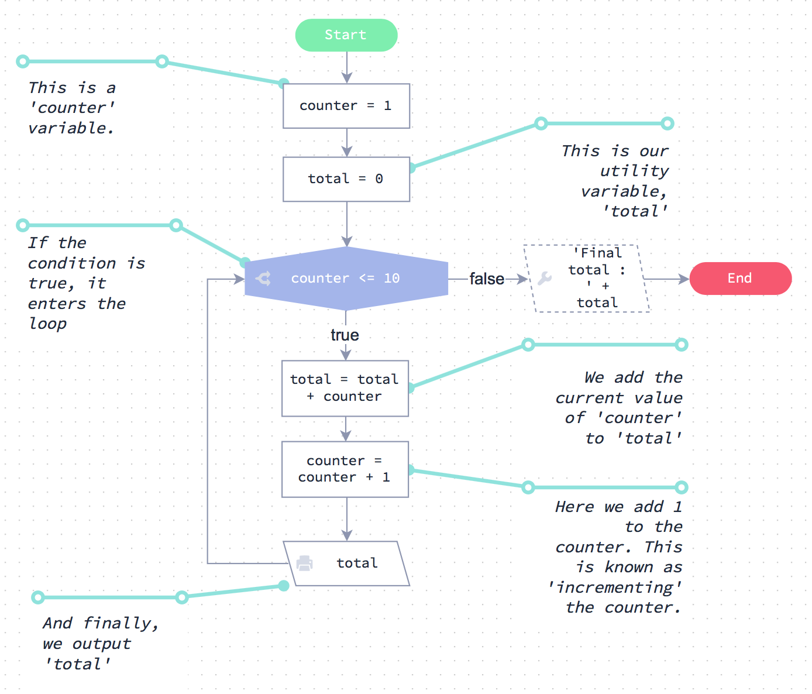

Esta unidad le presenta el concepto de usar bucles en código.

Podrían parecer un poco aterrador, pero obtendrá dominarlos muy rápidamente.

### El bucle for

```js
var total= 0							// variable del contador 
for(var ctr = 0; ctr <= input0; ctr++) {// bucle hasta la input0 
	total = total + ctr 		   	 	// incremento total del contador de bucle 
	console.log (total) 			 	// output el total actual
}

```

### El bucle while

```js
var ctr = 0   							// variable de bucle 
var total = 0 							// variable de contador 
while (ctr <= input0) { 				// bucle hasta que ctr es igual a input0 
	total = total + ctr++   			// aumenta el total por el número de bucle, incremento
	console.log (total) 				// fuera del total actual
}
```

1 \. 1 \. Experimentos
======================

Esta ventana se proporciona para que pruebe cualquier código que desarrolle. Úselo para experimentar y practicar.

```js
// Escribe el código experimental a continuación
//

console.log ('su archivo de experimentos')
```

[EJECUTE SU CÓDIGO]()

2 \. Descripción de Loops
=========================

Antes de comenzar a usar bucles en código, eche un vistazo al gráfico de Flode a la izquierda.

Es un bucle muy simple pero es un buen lugar para comenzar.

! [Screenshot 2017-07-13 20.35.12.png](resources/ EB31491F9C954EB3816EC85488201B9F.png)

2 \. 1 \. El bucle while
========================

El código que ves a la izquierda es el equivalente exacto del gráfico de Flode, pero escrito en JavaScript.

Tener un empuje en la ejecución del código:

```js
var counter = 0 			// Esta es una variable 'counter'.

while (contador <= 9) {		// Si la condición es verdadera, se vuelve hacia atrás
  console.log (contador)
  counter = counter + 1 	// Aquí agregamos 1 al contador. Esto es conocido
                            // como "incrementar" el contador.
}

```

[EJECUTE]()

2 \. 2 \. While explicado
=========================

Echa un vistazo al código con más detalle. Debe ser bastante fácil de entender, ya que es muy similar al gráfico de Flode.

El bloque de código while
-------------------------

Eche un vistazo a la sentencia `while` y su bloque de código.

Cada sentencia while se ve así:

```js
while ( alguna_condicion) { 
	algun_código 
	algun_codigo_más 
	incluso_algun_codigo_más
}  
el código continúa ejecutándose aquí 
una vez que 'alguna_condicion' ya no es true
```

Lo que esto dice es lo siguiente: *“Mientras la condición es verdadera, ejecuta todas las sentencias de código que ocurren ** dentro ** de éste bloque de código.”*

Por lo tanto, el bucle va y viene hasta que la condición es falsa. Exactamente igual que con el gráfico de Flode.

En el ejemplo de código, cada vez que se ejecutan las sentencias en el bloque de código, la variable `counter` se incrementa en uno. Eventualmente, alcanza el valor `10`, momento en el cual la condición se vuelve falsa y cualquier declaración después de ejecutar el bloque de código.

Juega
-----

Siéntase libre de cambiar algunos de los valores en el código y ejecutarlo de nuevo utilizando el botón de abajo. También puedes añadir más de uno a `counter` en cada bucle * iteracion * y ver qué pasa.

```js

var counter = 0 			// Esta es una variable 'counter'.

while (counter <= 9) {		// Si la condición es verdadera, se vuelve hacia atrás
  console.log (counter)
  counter = counter + 1 	// Aquí agregamos 1 al contador. Esto es conocido
                          	// como 'incrementando' el contador.
}

```

[EJECUTAR]()

Recuerde, si lo desea, puede restablecer el código del menú 'Configuración' en la parte superior. Para ello, seleccione la opción "Restablecer capítulo".

2 \. 3 \. Tenga cuidado con los bucles infinitos
================================================


Un error común que la gente a veces hace con los bucles `while`  es olvidar incrementar el contador.

Si, al completar los desafíos de esta sección, ve que no ocurre nada, es probable que haya creado un bucle infinito (se ha olvidado de incrementar su contador).

Eche un vistazo al código de la izquierda. ¿Puedes ver lo que está mal con él?

Si ejecuta el código, se ejecutará para siempre y el programa se bloqueará.

La razón de esto es que usted nunca está incrementando la variable `counter`, la condición siempre es verdadera (menos de 10), por lo que va y viene alrededor del bucle para siempre.

Ejecutelo y luego arreglarlo
----------------------------

Pulse el botón ‘Ejecute el codigo’ a continuación y verá que nunca obtiene nada.

Su reto es fijar el código incrementando el contador correctamente dentro del bucle. A continuación, debe ver el output correcto.

```js

// Obtener entrada desde la línea de comandos
var loops = 10 // prompt("input: ")

var ctr = 0
while (ctr < loops) {
  console.log (ctr)
}
```

[EJECUTE EL CÓDIGO]()

**Importante:** Si no ocurre nada al pulsar el botón de ejecución una vez que haya arreglado el código, es posible que deba volver una página y luego reenviarlo para actualizarlo.

3 \. Desafíos
=============

Ahora es el momento de probar algunos desafíos que te pondrán a prueba en lo que has aprendido sobre loops hasta ahora. Los retos se hacen más difíciles a medida que avanza - al tiempo que los ha completado, estará listo para comenzar con algunos algoritmos más complejos.

3 \. 1 \. Cuenta de 0 a N
==========================

Vamos a pasar en un valor, N. Usted debe escribir un programa donde los outputs  de todos los valores vayan de 0 a más incluyendo a N.

```js

// Obtener inputs desde la línea de comandos
var N = 10 // prompt("input: ")

// Su código va aquí

for (var i = 0; i <= N; i ++) {
  console.log (i);
}


```

[¡Revisalo!]()

3 \. 2 \. Contar de N a 0
==========================

¡Cuidado con el bucle infinito!

Le pasaremos un valor, N. Usted debe emitir cada valor positivo de N hacia abajo e incluyendo a 0.

```js

// Obtener entrada desde la línea de comandos
var N = 10 // prompt("input: ")

// Su código va aquí

```

[¡Revisalo!]()

3 \. 3 \. N a 0 o -N a 0
========================

Este es un desafío difícil para usted.

Pasaremos un valor N. N puede ser positivo o negativo.

* Si N es positivo, entonces emite todos los valores desde N hacia abajo  y ** excluyendo ** a 0.
* Si N es negativo, entonces emite cada valor desde N hacia arriba y ** excluyendo ** a 0.

```js

// Obtener input desde la línea de comandos
var N = 19 // prompt("input: ")

// Su código va aquí


```

[¡Revisalo!]()

4 \. Variables de utilidad
==========================

Hemos descubierto variables de utilidad antes, dentro de nuestras unidades Flode.

Resumen
-------

Muy a menudo en un bucle, necesitará actualizar un valor con cada * iteración * de su bucle. Al final del bucle es posible que desee hacer algo con ese valor.

A la izquierda hay un buen ejemplo de esto mostrado en un gráfico de Flode. El gráfico de Flode está haciendo lo siguiente:

> Sumar todos los valores entre 0 y 10 y dar output al resultado.

Pase a través de la tabla y observe con cuidado la variable llamada `total`. Puede ver que la variable `total` se actualiza cada vez que pasamos por el bucle. Una vez que el bucle está terminado, emitimos el `total` que ha estado aumentando con cada * iteración * del bucle.

Una serie de desafíos que siguen requieren que utilice esta técnica, así que asegúrese de que usted lo entiende.



4 \. 1 \. Código equivalente
============================

A la izquierda está el código JavaScript equivalente al gráfico de Flode de la página anterior.

Si ejecuta el código, verá que se ocupa del bucle exactamente de la misma manera que el gráfico de Flode.

```js

var counter = 1 				// Esta es una variable 'counter'.
var total = 0 					// Esta es nuestra variable de utilidad, 'total'

while (counter <= 10) {			// Si la condición es verdadera, entra en el bucle
  total = total + counter 		// Añadimos el valor actual de 'contador' a 'total'
  counter = counter + 1 		// Aquí agregamos 1 al contador. Esto se conoce como
                             	// 'incrementar' el contador.
  console.log (total) 			// Y finalmente, la salida 'total'
}


```

[EJECUTE EL CÓDIGO] ()

5 \. Bucles For
===============

Hasta ahora has aprendido sobre los bucles `while`. Ahora vas a mirar un bucle diferente, que hace lo mismo, pero con una sintaxis diferente (estructura de sentencias) que lo hace más adecuado para tareas particulares.

```js

// Obtener input desde la línea de comandos
var N = 10 // prompt("input: ")

// usaremos esta variable para mantenerse al día con el total
var total = 0

for(var ctr = 0; ctr <= N; ctr ++) {	// bucle de 0 a 10
  Total = total + ctr 					// agrega valor de bucle al total
  console.log (total) 					// imprimir el total actual
}

console.log ('Final total:' + total) // imprimir final total

```

[EJECUTE EL CÓDIGO]()

Eche un vistazo al código de la izquierda. Hace lo mismo que el código de bucle `while` escrito abajo.

```
// Obtenemos la entrada de la línea de comando 
var N = 10 // prompt("input: ")

// usaremos esta variable para mantenerse al nivel de
var total = 0 

var ctr = 0 			// variable de bucle 
while (ctr \ <= N) {	// bucle 0 a 10 total 
	total = total + ctr // agregar valor de bucle al total 
	ctr = ctr + 1 		// incremento del contador de bucle 
	console.log (total) // imprimir total actual
}

console.log ('Total final: '+ Total) // imprimir total final

```

5 \. 1 \. For explicado
=======================


Echemos un vistazo al bucle `for` con más detalle.

```
var total = 0 
for (var ctr = 0; ctr \<= N; ctr++) {
	total = total + ctr 
	console.log(total) }
```

Observe que hay 3 partes en la sentencia `for`. Estos se explican a continuación.

Inicialización
--------------

`var ctr = 0;`

Esta es la parte de inicialización. Puede tener varias sentencias JavaScript separadas por un `,`. Al final pones un `;`

Condición
---------

`ctr \<= N; 'esta es la segunda parte. Es la condición del bucle. El bucle se ejecutará hasta que la condición ya no sea verdadera.

Final de las declaraciones de bucle (loop)
------------------------------------------

`ctr ++` es la sentencia final de bucle. Cualquier sentencia JavaScript encontrada aquí se ejecuta al final del bloque de código de bucle justo antes de que se evalúe la condición. Si hay más de una instrucción de fin de bucle, las sentencias están separadas por `,`

¿Qué es ctr ++?
---------------

Sigue trabajando en esta unidad y lo descubrirás!

5 \. 2 \. Un poco más sobre de For
==================================

Mira el código de la izquierda y verás que tenemos tres versiones diferentes de código que hacen lo mismo.

Hemos puesto `console.log (total)` en las instrucciones de fin de bucle. Si ejecuta el código, debe ver por sí mismo que cada salida termina igual.

```js

// Obtener un input desde la línea de comandos
var N = 10 // prompt("input: ")

// 
----------------------------------------------------------------
console.log ("Versión 1")
{
  var total
  for (var ctr = 0, totral = 0; ctr<= N; ctr ++, console.log(total)) {
    total = total + ctr
  }
  console.log ('Final Total : ' + total)
}

// 
----------------------------------------------------------------
console.log ("Versión 2")
{
  var total = 0 						// mantiene nuestro total
  for(var ctr = 0; ctr <= N; ctr ++) {	// bucle hasta input0
    total = total + ctr				    // agregar valor de bucle actual
    console.log (total) 				// resultado total hasta ahora
  }
  console.log ('Final Total : ' + total) // output final total 
}

// ------------------------------------------------ ----------------
console.log ("Versión 3")
{
  var total = 0 				// mantiene nuestro total
  var ctr = 0 					// nuestro contador de bucle
  while(ctr <= N) {				// loop hasta input0
    total = total + ctr++		// actualización de total, contador de incremento
    console.log (total) 		// output total hasta ahora
  }
  console.log ('Final total : ' + total) // final total del output
}
```

[EJECUTE EL CÓDIGO]()

Entonces cuál es la diferencia?
-------------------------------

Los bucles `for` y` while` son * funcionalmente equivalentes *. La diferencia entre los dos viene de decidir qué tipo de bucle indica mejor la intención del código . También tendrá que decidir qué tipo de bucle es más fácil de entender para otra persona que mira su código.

El primer ejemplo es malo.
-------------------------

1. Coloca toda la inicialización del bucle y variable lógica dentro de la sentencia `for`, lo que dificulta la comprensión de cómo se controla el bucle.
2. Esto hace que sea mucho más difícil hacer comentarios de alguna manera significativa.
3. También es mucho más difícil validar las condiciones de inicio y parada de un vistazo.
4. La declaración de la variable `total` se requiere para dar el alcance de la variable, pero la inicialización de` total` en la primera sección del bucle `for` deja el potencial de error entre ellos.
5. Una vez que haya visto las sentencias `for` y` while` unas cuantas veces, el bucle como un todo será más fácil de leer, independientemente del lazo que se elija.

Jugar
----

Siéntase libre de experimentar con el código de la izquierda. Si lo estropeas, puedes restablecerlo eligiendo la opción 'Restaurar archivos actuales' en el menú 'Configuración' en la parte superior de esta página.

5 \. 3 \. ctr++, ctr--
======================

`ctr++` se utiliza al final de bucle.

El operador `++ 'se llama el operador * operador de incremento *. Incrementa una variable por uno.

Si se escribe `++` después de la variable, como esto: `c++`, la variable se incrementa después de que se evalúa la sentencia. Si se escribe `++`, como esto: `++c`, la variable se incrementa antes de que se evalúe la sentencia. Esto puede afectar el orden de las operaciones.

A continuación, `b` terminará con un valor de 8 y` c` con un valor de 5:

```js
var c= 4
var b= 2 * c++
console.log(b)
console.log(c)
```

Pero en el siguiente ejemplo, `b` terminará con un valor de 10 porque` ++c` establece `c = 5` antes de evaluar` 2 \ * c`. La variable `c` como antes tendrá un valor de 5:

```js
var c= 4
var b= 2 * ++c
console.log(b)
console.log(c) 
```

variable+= and variable-=
Aquí tenemos una solución corta  (una manera corta y limpia de escribir).  
```js
ctr += 10 es la manera corta de ctr = ctr + 10
ctr -= 10 es la manera corta de ctr = ctr - 10
ctr *= 10 es la manera corta de = ctr * 10
ctr /= 10 es la manera corta de = ctr / 10
```

6 \. Desafíos
==============

Aquí hay un conjunto final de retos para completar. Estos desafíos requieren el uso de variables de utilidad.

Cuando complete los siguientes desafíos, utilice la sentencia `for` y no` while`.

6 \. 1 \. Tabla de tiempos
==========================

Le proporcionaremos un número N. Proporcione el output de la tabla de tiempos para ese número de 1 a 12.

Por lo tanto, si pasamos en 6, debe salir 6, 12, 18, 24 ... 66, 72

```js

// Obtener entrada desde la línea de comandos
var N = 6 // input ()

// Su código va aquí


```

[¡Revisalo!]()


6 \. 2 \. Factorial
==================

Factorial de X, también puede ser escrito como X!X! , Es X * (X - 1) * (X - 2) * (X - 3) .... * (1) X * (X - 1) * (X - 2) * (X - 3) .. .. * (1).

Entonces, `4!` Es `4*3*2*1 = 24`.

Le proporcionamos un valor N. Calcular N! Y el output sólo del resultado final.

```js

// Obtener input desde la línea de comandos
var N = 4 // input ()

// Su código va aquí

```

[¡Revisalo!]()

6 \. 3 \. Cuadrado
==================

Le proporcionaremos un valor N. Usted debe calcular la suma de cada valor de N al cuadrado de 0 hasta y incluyendo N.

En la notación matemática, esto se escribe como ΣNi = 0i2Σi = 0Ni2

Así que si pasamos en 3, que la salida 02 + 12 + 22 + 32 = 14

```js

// Obtener entrada desde la línea de comandos
var N = 3 // input ()

// Su código va aquí


```

[¡Revisalo!]()


6 \. 4 \. X a la Y
==================

Vamos a pasar en 2 valores, X e Y. Usted debe calcular XYXY y en el output sólo el resultado final.

Probablemente sepa que XYXY puede calcularse como X veces a sí mismo Y veces.

```js

// Obtener input desde la línea de comandos
var X = 19 //  prompt()
var Y = 10 //  prompt()

// Su código va aquí


```

[¡Revisalo!]()

6 \. 5 \. Fibonacci
===================

La secuencia de Fibonacci es la serie de números:

0, 1, 1, 2, 3, 5, 8, 13, 21, 34, ...

El siguiente número en la secuencia se calcula sumando los dos números anteriores.

* Comenzamos con 0 y 1
* El primer 1 en la lista anterior se encuentra agregando los 2 números anteriores (0 + 1)
* El 2 se encuentra agregando los dos números antes de él (1 + 1)
* Similarmente, el 3 se encuentra agregando los dos números antes de él (1 + 2),
* El 5 es (2 + 3)

¡y así!

Pasaremos un valor N. Escribiremos un programa que genere la secuencia Fibonacci completa para N iteraciones.

** Importante: ** Si N es 0, entonces esperamos obtener un output de '0'. Si N = 1 entonces esperamos `0, 1`, etc.

```js

// Obtener un input desde la línea de comandos
var N =  10 // prompt("input: ")

// Su código va aquí


```

[¡Revisalo!]()

7 \. La sentencia 'break'
==========================

La instrucción `break` es una forma de escapar de un bucle antes de que se cumpla la condición del bucle.

La instrucción `break` no debería nunca necesitar ser usada. Cualquier programa que parece requerir una sentencia break puede ser reescrito para funcionar igualmente bien sin él.

Echa un vistazo al código de la izquierda. El código muestra un bucle que cuenta de 0 a 9\. Sin embargo, la sentencia `break` en el bucle está esperando para ver si el índice de bucle golpea a 7, y si lo hace, el bucle se sale inmediatamente.

Este es un ejemplo artificial, pero ilustra muy bien cómo funciona la ruptura.

```js

for (var i=0; i<10; i++ ) {
  console.log(i)
  if (i == 7) {
    break
  }
}
console.log ('Finalizado').
```

[EJECUTA EL CÓDIGO]()

7 \. 1 \. La instrucción 'continue'
===================================

La instrucción `continue` se utiliza para saltar sobre una iteración y continuar el bucle desde la parte superior.

El ejemplo de la izquierda muestra un bucle que salta mostrando el contador de bucle si es un número impar.

Como `break` en la página anterior,` continue` no debería ser necesaria bajo ninguna circunstancia normal. Cualquier código que parece requerir una instrucción de continuación podría volver a escribirse mejor sin ella.

```js

for (var i=0; i<10; i++) {
  if (i % 2 == 1) {
    continue
  }
  console.log (i)
}
console.log ('Finalizado').
```

[EJECUTE EL CÓDIGO]()

7 \. 2 \. Todo listo
====================

¡Bien hecho!

En esta unidad has aprendido a usar bucles de control con `for` y ` while`. Seguirá aprendiendo más acerca de los bucles de control en las siguientes unidades.